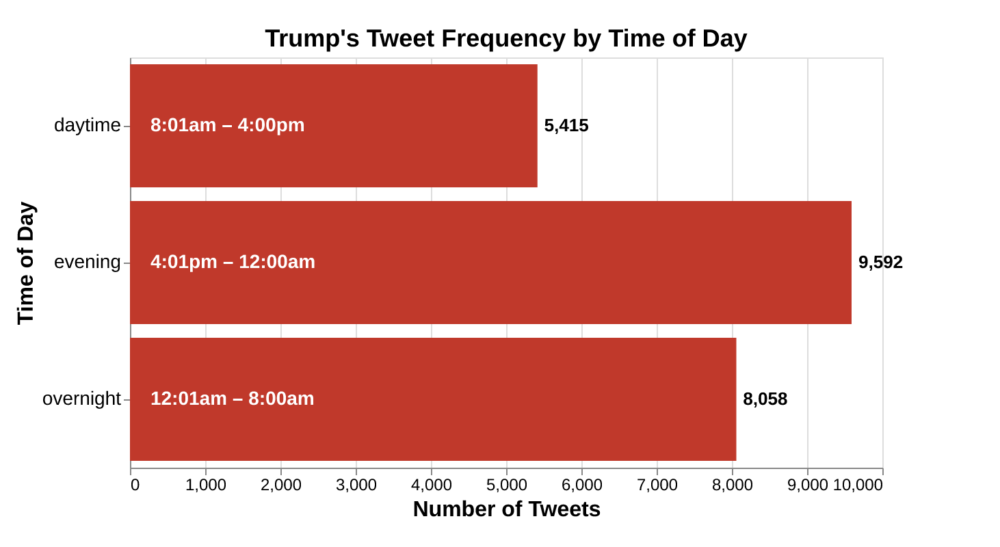
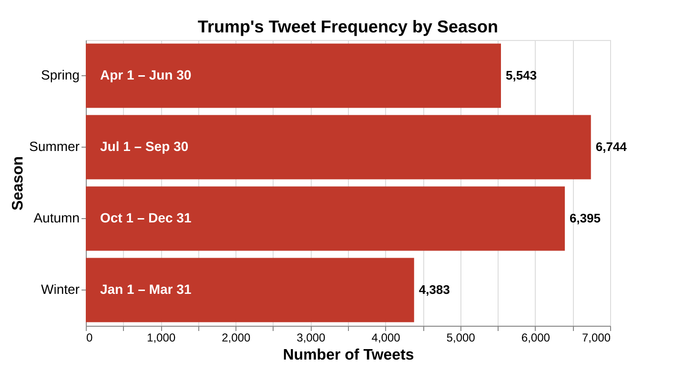
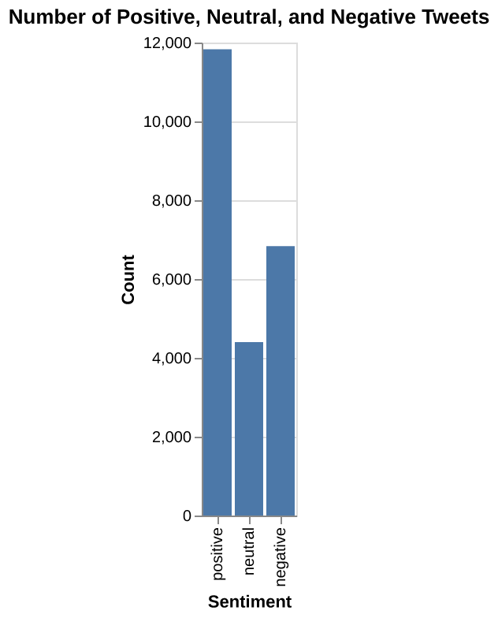
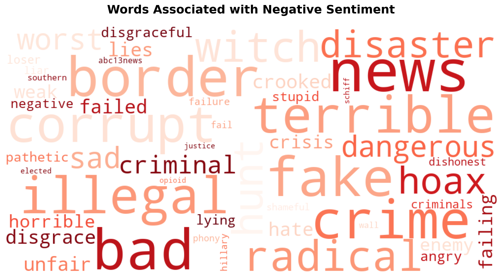
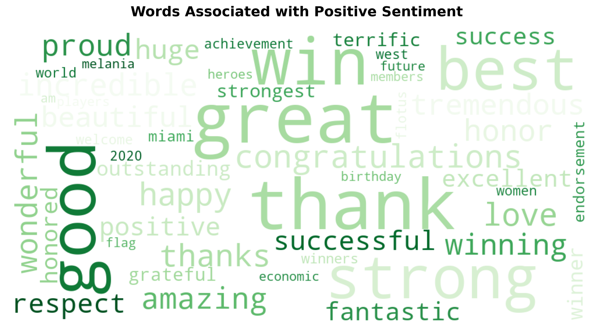

```{python}
import pandas as pd
from IPython.display import Markdown
```
```{python}
time_day_summary = pd.read_csv('../results/tables/time_of_day_summary.csv')
most_frequent_time = time_day_summary.loc[time_day_summary['Count'].idxmax(),'Time of Day']
least_frequent_time = time_day_summary.loc[time_day_summary['Count'].idxmin(),'Time of Day']
time_freq_increase =round((time_day_summary['Count'].max()-time_day_summary['Count'].min())/time_day_summary['Count'].min()*100,2)
```
```{python}
season_summary = pd.read_csv('../results/tables/season_summary.csv')
most_frequent_season = season_summary.loc[season_summary['Count'].idxmax(),'Season']
least_frequent_season = season_summary.loc[season_summary['Count'].idxmin(),'Season']
season_freq_increase =round((season_summary['Count'].max()-season_summary['Count'].min())/season_summary['Count'].min()*100,2)
```
```{python}
sentiment_count = pd.read_csv('../results/tables/sentiment_counts.csv')
positive_freq = round(sentiment_count.loc[0,'Count']/sentiment_count['Count'].sum()*100,2)
negative_freq = round(sentiment_count.loc[2,'Count']/sentiment_count['Count'].sum()*100,2)
neutral_freq = round(sentiment_count.loc[1,'Count']/sentiment_count['Count'].sum()*100,2)
most_sentiment = sentiment_count.loc[sentiment_count['Count'].idxmax(),'Sentiment']

```

# Summary
In this report we will be analyzing Tweets published by Donald Trump during his first presidency, focusing on two different aspects : frequency and sentiment. We started by considering how the time of day and season affects the frequency of the tweets. Our research reveals that there is a variation in the frequency depending on time of day and that there is a `{python} time_freq_increase`% increase in the number of tweets published from the `{python} least_frequent_time` to the `{python} most_frequent_time`. We also found that changing the season also had an impact on the frequency, with there being a `{python} season_freq_increase`% increase in the number of tweets from the season where he posts the least (`{python} least_frequent_season`) to the season where he posts the most (`{python} most_frequent_season`). Additionally, we performed sentiment analysis using the VADER lexicon to classify the tweets and determine the frequency of positive, negative and neutral tweets. We found that around `{python} positive_freq`% of the tweets were classified as positive and `{python} negative_freq`% as negative. Using the positive and negative labels, we will train a Logistic Regression model to determine the most frequently used words in the positive and negative tweets. We found that the positive tweets most often contained words of praise and common phrases used by Trump, as well as his own name, while the negative tweets most often used words to refer to opposing political parties and leaders. 


# Introduction
Twitter (also known as X) is one of the world's most popular social media platforms, where users can share short messages (texts, videos, photos) known as tweets. In April 2025, the Pew Research Center did a study and found that on average active users published 157 tweets per month, which is around 5 tweets per day [@gottfried2025americans]. At the beginning of his first presidency, Donald Trump followed the average, posting about 5.7 times per day. However, towards the second half of 2020, his posting rate grew to around 34.8 times per day. On June 5 2020, he went as far as tweeting or retweeting 200 messages in a single day [@McCarthy_Richter_2021]. With so much data, we thought it would be interesting to consider what could affect his frequency of posting. The president uses the platform mostly to disparage those he perceives as threats (people, companies, countries...), with more than half of his tweets between January 2017 and October 2019 being used to attack something or someone [@shear2019trump]. Another interesting question to consider would be to determine how many of his tweets can be considered as positive or negative, and to see which words come up more often for each category. In this report, we will start by considering different factors (time of day or season) that might have an impact on the frequency of the tweets, then we will classify the tweets into positive, negative or neutral to determine the most used words in the positive and negative tweets.

The dataset we are using contains all tweets published (includes deleted tweets) published by Donald Trump during his first presidency between 20 Jan 2017 and 08 Jan 2021. It contains 5 columns (ID, Time, Tweet URL, Tweet Text) and each row represents a tweet. The dataset can be found in this repository [CompleteTrumpTweetsArchive](https://github.com/MarkHershey/CompleteTrumpTweetsArchive?tab=readme-ov-file "CompleteTrumpTweetsArchive"), in the data folder, specifically the file [realDonaldTrump_in_office.csv](https://github.com/MarkHershey/CompleteTrumpTweetsArchive/blob/master/data/realDonaldTrump_in_office.csv "realDonaldTrump_in_office.csv").

# Method

## Analysis

In the first part, we will be doing a visual analysis on the variation in tweet posting frequency between different times of day (daytime, evening, overnight), then between different seasons (winter, summer, autumn, spring).
In the second part, we will use the VADER lexicon to classify the tweets into either positive, neutral or negative categories. With the tweets now classified into positive and negative (we will consider neutral tweets as positive), we will use a bag of words approach on the tweets (CountVectorizer) to train a logistic model. We will then extract the coefficients from the model to determine the top positive and negative words.

# Results
## Part I: Does the time of day or season affect the frequency of the tweets?

With the president posting 34.8 times per day [@shear2019trump] it is interesting to consider whether the time of day or even the period of the year affects the frequency of his tweets. <br>
Before our analysis, we believed that the frequency of tweets would be highest during the daytime and night-time. These assumptions were proven wrong as the numbers show that the most frequent time of day for tweets was the `{python} most_frequent_time` period. 

The initial data filtering by time of day (@tbl-time-of-day-counts) shows that the highest frequency of tweets occurs during the `{python} most_frequent_time` period between `{python} time_day_summary.loc[0,'Time Range']` (as mentioned above) with a total of `{python} time_day_summary['Count'].max()` analyzed tweets. The second most frequent tweet period occurred during the `{python} time_day_summary.loc[1,'Time of Day']` period between `{python} time_day_summary.loc[1,'Time Range']` with a total of `{python} time_day_summary.loc[1,'Count']` analyzed tweets, with the time of day resulting in the least frequent amount of tweets actually being the `{python} least_frequent_time` period between `{python} time_day_summary.loc[2,'Time Range']` with a total of `{python} time_day_summary['Count'].min()` analyzed tweets. Perhaps this is because Trump is most busy during the day (golfing?) and cannot tend to tweets.


```{python}
#| label: tbl-time-of-day-counts
#| tbl-cap: "Number of tweets published by time of day (daytime: 8:01am–4:00pm, evening: 4:01pm–12:00am, overnight: 12:01am–8:00am)."
Markdown(time_day_summary.to_markdown(index=False))
```


The seasonal filtering of the tweets (@tbl-season-counts) returned the results of the most frequent amount of tweets being in the `{python} most_frequent_season` with `{python} season_summary['Count'].max()` analyzed tweets, with the `{python} season_summary.loc[1,'Season']` being the second busiest season for tweets resulting in `{python} season_summary.loc[1,'Count']` analysed tweets, followed by the `{python} season_summary.loc[2,'Season']` recording `{python} season_summary.loc[2,'Count']` analyzed tweets, and lastly the `{python} least_frequent_season` being the least busy season for tweets recording a number of `{python} season_summary.loc[3,'Count']` tweets. This falls inline with inutitive assumptions about mood and activity as the summer is usually the busiest with longer days (daylight) and nicer weather, then the fall slowly tapers off into the winter season being the shortest days for daylight and the most restricting weather.


```{python}
#| label: tbl-season-counts
#| tbl-cap: "Number of tweets published by season (Spring: Apr 1–Jun 30, Summer: Jul 1–Sep 30, Autumn: Oct 1–Dec 31, Winter: Jan 1–Mar 31)."
Markdown(season_summary.to_markdown(index = False))
```

Hence, we can see that time of day and season do affect the number of tweets posted, with the theoretical most prolific time period for posting being in `{python} most_frequent_season` during the `{python} most_frequent_time`.


{#fig-time-of-day width=70%}


{#fig-season-frequency width=70%}


Now visually comparing @fig-time-of-day and @fig-season-frequency, we see that time of day has a higher impact on the frequency than season does. Indeed,  there is a `{python} time_freq_increase`% increase in the number of tweets published from the `{python} least_frequent_time` to the `{python} most_frequent_time`, while changing the season from  `{python} least_frequent_season` to `{python} most_frequent_season` only results in a `{python} season_freq_increase`% increase. 

## Part II: How many tweets are positive vs negative? 

When we think of the tweets posted by the president, we tend to think mostly of those where he critices or attacks others. However, is this a real representation of the sentiments of his tweets? In this part we will begin by classify the tweets into positive, negative or neutral, then we will use those labels to analyse the words in the tweets for the positive and negative classes.

### Classifying the tweets
We use a simple sentiment analysis model (VADER) to classify each tweet as positive, negative, or neutral, and then compare the counts, this methodological inspiration is from ChatGPT.


```{python}
#| label: tbl-sentiment-counts
#| tbl-cap: "Number of tweets per sentiment (negative, neutral, positive)."
Markdown(sentiment_count.to_markdown(index = False))
```


Using the VADER sentiment analyzer the tweets were classified as either positive, neutral, or negative (@tbl-sentiment-counts). At first, we believed that the tweets were likely more negative than positive, but in fact the tweets were classified as far more `{python} most_sentiment` than negative, with the `{python} most_sentiment` class representing `{python} positive_freq`% of the total tweets. On the other hand, the negative class only represent `{python} negative_freq`% of the total number of tweets, with the number of 'neutral' tweets close behind with `{python} neutral_freq`%. 

{#fig-sentiment-dist width=50%}

The actual context and literal meaning of the tweets was not analyzed, nor the accuracy of the classification at this point, so there is certainly going to be a margin of error and some 'false positives' etc as the positivity is quite often a self directed compliment of sorts.

### Analysing the words in each tweet
Using a CountVectorizer and Logistic Regression, combining with a Wordcloud visualization to determine the most frequent words in the positive and negative tweets. Syntax and bug fixing credited to ChatGPT 5.1 <br>

The second classifier method used to analyze the tweets was utilizing the CountVectorizer() to classify sets as positive words, negative words and some stop words unique to this dataset. The overall positive VS negative tweet counts are skewed in the opposite direction as the 'neutral' category here is somewhat added to the postively classified category.
```{python}
#| tbl-cap: "Accuracy of the model"
#| label: tbl-model-accuracy
model_accuracy = pd.read_csv('../results/tables/model_metrics.csv')
Markdown(model_accuracy.to_markdown(index = False))
```

While the model achieves a high accuracy score (@tbl-model-accuracy), it might not be a true reflection of how it would perform in the 'real' world. Indeed, this model does not consider intricacies of language (sarcasm, neutral tweets added to positive class) that can change the sentiment of the message.
```{python}
top_pos_words = pd.read_csv('../results/tables/top_positive_words.csv').head(4)[['word','coefficient']]
most_pos_word = top_pos_words.loc[0,'word']
praise_word = top_pos_words.loc[2,'word']
maga_word = top_pos_words.loc[1,'word']
```

The results of the most frequent words (@tbl-positive-words) are not very surprising to anyone who has followed American news at all in the last 10 years with the positive tweets containing words of praise (`{python} most_pos_word`,`{python} praise_word`) and common phrases used by Trump (`{python} maga_word`).

```{python}
#| tbl-cap: "Most frequent words in positive tweets"
#| label: tbl-positive-words
Markdown(top_pos_words.to_markdown(index = False))
```

```{python}
top_neg_words = pd.read_csv('../results/tables/top_negative_words.csv').head(8)[['word','coefficient']]
criticise_word = top_neg_words.loc[2,'word']
criticise_word_other = top_neg_words.loc[7,'word']
most_neg_word = top_neg_words.loc[0,'word']
common_word = top_neg_words.loc[3,'word']
```
The most frequent words appearing in the negative tweets (@tbl-negative-words) could also be somewhat assumed as they words he commonly uses to criticize the opposing political parties and leaders (`{python} criticise_word`, `{python} criticise_word_other`) as well as other common phrases and words that one would hear often in a news report of Trump lashing out over twitter or a speech (`{python} most_neg_word`, `{python} common_word`) .


```{python}
#| tbl-cap: "Most frequent words in negative tweets"
#| label: tbl-negative-words
Markdown(top_neg_words.to_markdown(index = False))
```

A great visual indicator of these word frequencies is the word clouds (@fig-wordcloud) for the respective most frequent positive and negatively classified words. Here we can see that the words in each class make sense (it makes sense that words like bad or corrupt would be used in negative tweets while words like strong or best would be used in positive tweets). 


::: {#fig-wordcloud layout-ncol=2}

{#fig-neg-wordcloud}


{#fig-pos-wordcloud }

Word clouds
:::

It is interesting to note that `{python} most_neg_word` is heavily associated with negative tweets as in and of itself it is not negatively connotated, but it is a word that Donald Trump often uses to criticize the media.


# Discussion

With social media becoming more and more essential in politics, especially when engaging with the general public, it is interesting to note exactly how an inlfluential political presence (such as Donald Trump) uses this platform to spread a message. 
Within this report we considered multiple aspects of the tweets. Firstly we determined that Donald Trump's most productive time and season for posting was `{python} most_frequent_season` during the `{python} most_frequent_time`. Then we determined that, contrary to what we originally believed, most of his tweets are actually positively connotated. Now, as mentioned above, our sentiment classification methods might not be a faithful representations of the sentiment of the tweets, as there might be hidden meanings that the bag of words approach does not pick up on. 


# References
